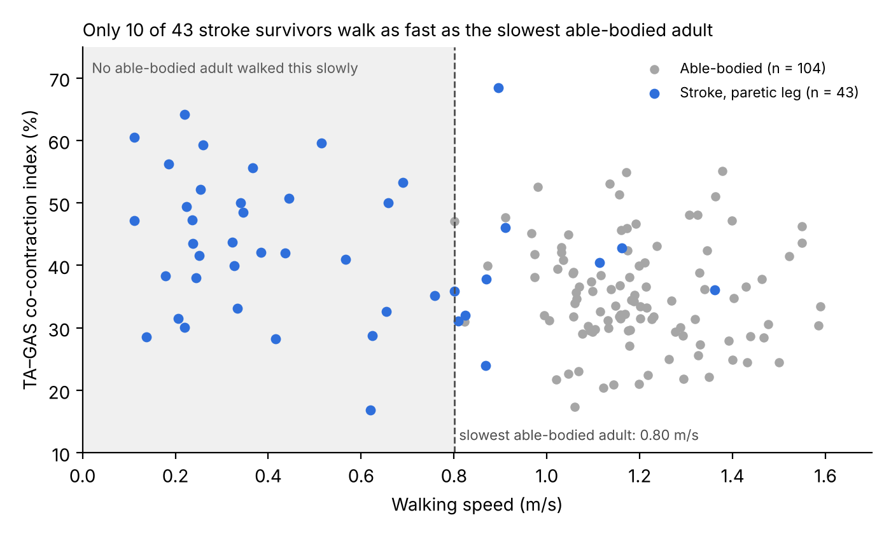
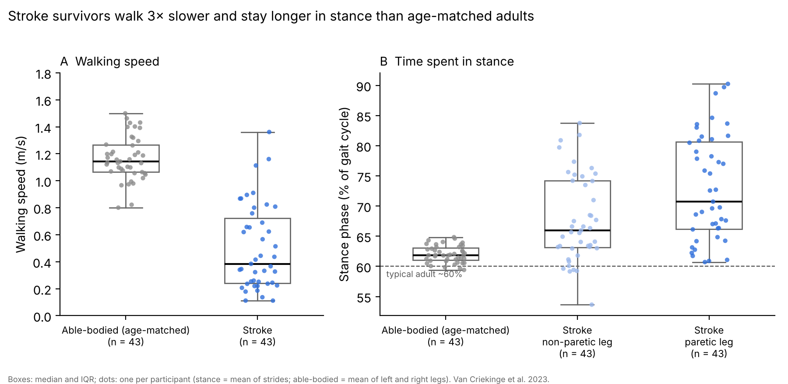

# BMEN-600-Project

## Team 3
Matthew Christoffersen  
Dylan Lam  
Yohan Min  
Perpetual Ogedegbe  

## Research question
Compared with age-matched able-bodied adults, do subacute stroke survivors show more co-contraction of knee (VL–BF, VL–ST) and ankle (TA–GAS) muscle pairs on the paretic side during walking, and does any difference remain after accounting for walking speed?

## Project decision
**GO**: we are proceeding with this research question and dataset. Tibialis anterior EMG is available in the MAT files (see Data checks).

## Contents
1. [Progress update: October 9, 2026](#progress-update-october-9-2026)
2. [How to run the analysis](#how-to-run-the-analysis)
3. [Project background](#project-background)
4. [Analysis plan](#analysis-plan)
5. [Team plan](#team-plan)


---

## Progress update: October 9, 2026

### What we did today
- Built the data pipeline in `src/`: download the MAT files, build the participant table, and compute co-contraction and stance outcomes for every participant leg.
- Checked the dataset against the paper (see [Data checks](#data-checks)).
- Ran the midterm progress check: sample and data quality (Table 1), co-contraction by group (Table 2) and Figure 1.
- Made Figure 2, a comparison of gait between stroke survivors and age-matched able-bodied adults.

### Data checks
- **TA is not in the Excel files**, so we use the MAT files (MATLAB v7.3 / HDF5, read with `h5py`).
- **Fewer participants have EMG than the paper reports.** MAT files: 44 of 50 stroke survivors have any EMG (paper: 47). TVC51, TVC53 and TVC54 have none, although Supplementary Table 4 lists EMG as recorded; TVC42 has no paretic-leg EMG. 109 of 138 able-bodied adults have EMG (paper: 111); SUBJ21, SUBJ74 and SUBJ84 are also empty. Raw and normalized fields are both empty for these participants.
- **Left TA is often missing in able-bodied adults** (usable in 59, vs 105 for right TA), so we average whichever legs are available.
- **Supplementary Table 1 is in a different order from the MAT files** from SUBJ15 onward. We take age, sex and body size from the MAT file (`sub_char`), and number able-bodied participants by their MAT position (SUBJn = `Sub(n)`), which matches Supplementary Table 5 and the paper's list of missing EMG.
- **Walking speed** is computed from centre-of-mass travel per stride in the MAT files. It agrees with Supplementary Table 5 (median difference 0.003 m/s); SUBJ116 has no centre-of-mass data, so its Table 5 speed is used.
- **Paretic side:** stroke data are already split into paretic (`Pside`) and non-paretic (`Nside`) legs; `sub_char.LesionLeft` gives the lesion side.
- **Speed overlap is small:** only 10 of 43 stroke survivors with paretic EMG walk at or above the slowest able-bodied adult (0.80 m/s).

#### Data checklist
- [x] Does the Excel file really leave out TA? Yes, so we use the MAT files.
- [x] How the stroke files mark the affected (paretic) side: separate `Pside`/`Nside` fields; lesion side in `sub_char.LesionLeft`.
- [x] Per-participant walking speed: computed from the MAT files and checked against Supplementary Table 5.
- [ ] Stroke kinetics were not outlier-screened by the authors, and stroke EMG screening is not documented: plot every participant's envelopes before relying on them.
- [ ] Check whether the C3D files hold the EMG that is missing from the MAT files (TVC51, TVC53, TVC54, TVC42 paretic; SUBJ21, SUBJ74, SUBJ84).
- [ ] Check that the paretic and non-paretic toe-off events (`P_TOnorm`, `N_TOnorm`) are on the right legs: the paretic stance is unexpectedly longer in Figure 2 (e.g. TVC36, TVC03).

### Results so far (descriptive only, no hypothesis tests yet)
- **Table 1** (sample and data quality): `results/tables/table1_sample_and_quality.csv`
- **Table 2** (co-contraction by group and its correlation with speed): `results/tables/table2_cci_by_group.csv`

#### Figure 1: Ankle co-contraction vs. walking speed


Data: `results/tables/fig1_points.csv`. Made by `src/preliminary_check.py`.

#### Figure 2: Gait of stroke survivors vs. age-matched able-bodied adults



43 stroke survivors (paretic EMG available) vs. 43 able-bodied adults matched 1:1 by age. Boxes show median and IQR; each dot is one participant. Data: `results/tables/fig2_points.csv`.
- **Walking speed:** median 0.38 m/s after stroke vs. 1.14 m/s able-bodied (about 3× slower).
- **Stance phase:** median 62% of the gait cycle able-bodied, 66% on the non-paretic leg and 71% on the paretic leg.
- **To check:** the paretic leg has the longer stance in 36 of 43 stroke survivors, the reverse of what most stroke gait studies report. Confirm in the MAT file that `P_TOnorm` and `N_TOnorm` are on the right legs (e.g. TVC36, TVC03).

##### Code for Figure 2
**Inputs:** `data/metadata/participants.csv` (age, walking speed) and `results/tables/outcomes_per_leg.csv` (stance % per leg, from the toe-off events). Age-matching and the analysis set come from `src/preliminary_check.py`.

**Run it** from the repository root, after `build_participants.py` and `compute_outcomes.py`:
```bash
python src/gait_comparison.py
```

<details>
<summary>Full script: <code>src/gait_comparison.py</code></summary>

```python
"""Gait comparison: stroke survivors vs. age-matched able-bodied adults.

Two spatiotemporal gait measures, no EMG:
  - walking speed (m/s), one value per participant
  - stance phase (% of the gait cycle from heel strike to toe-off), per leg

Uses the same analysis set and 1:1 age-matching as src/preliminary_check.py.
Descriptive only (medians and IQRs); no hypothesis tests.

Run after src/build_participants.py and src/compute_outcomes.py.

Outputs
  results/tables/fig2_points.csv   (data behind Figure 2)
  results/figures/fig2_gait_stroke_vs_able_bodied.png
"""
import matplotlib
matplotlib.use("Agg")
import matplotlib.pyplot as plt
import numpy as np
import pandas as pd

from preliminary_check import FIGS, PAIRS, ROOT, TABLES, age_match, per_participant

COLORS = {"Able-bodied (age-matched)": "0.55", "Stroke, non-paretic leg": "#9db9ec",
          "Stroke, paretic leg": "#2f6fdb", "Stroke": "#2f6fdb"}


def main() -> None:
    meta = pd.read_csv(ROOT / "data" / "metadata" / "participants.csv")
    outcomes = pd.read_csv(TABLES / "outcomes_per_leg.csv")
    st_cci, ab_cci = per_participant(outcomes)
    st = meta[meta.group == "stroke"].merge(st_cci, on="id")
    ab = meta[meta.group == "able-bodied"].merge(ab_cci, on="id")
    st_use = st[st[[f"CCI_{p}_P" for p in PAIRS]].notna().any(axis=1)].reset_index(drop=True)
    ab_use = ab[ab[[f"CCI_{p}" for p in PAIRS]].notna().all(axis=1)].reset_index(drop=True)
    ab_matched = age_match(st_use, ab_use)

    stance = outcomes.pivot_table(index="id", columns="leg", values="stance_pct")
    ab_stance = outcomes[outcomes.group == "able-bodied"].groupby("id").stance_pct.mean()

    pts = pd.concat([
        pd.DataFrame({"id": ab_matched.id, "series": "Able-bodied (age-matched)",
                      "speed_mps": ab_matched.speed_mps.values,
                      "stance_pct": ab_stance.reindex(ab_matched.id).values}),
        pd.DataFrame({"id": st_use.id, "series": "Stroke, paretic leg", "speed_mps": st_use.speed_mps,
                      "stance_pct": stance["paretic"].reindex(st_use.id).values}),
        pd.DataFrame({"id": st_use.id, "series": "Stroke, non-paretic leg", "speed_mps": st_use.speed_mps,
                      "stance_pct": stance["non-paretic"].reindex(st_use.id).values}),
    ])
    pts.round(3).to_csv(TABLES / "fig2_points.csv", index=False)

    rng = np.random.default_rng(0)
    fig, (ax1, ax2) = plt.subplots(1, 2, figsize=(9, 4.4), dpi=200, gridspec_kw={"width_ratios": [2, 3]})

    def strip(ax, groups, col, labels):
        data = [g[col].dropna().values for g in groups]
        bp = ax.boxplot(data, widths=0.5, showfliers=False, patch_artist=True,
                        medianprops={"color": "k", "lw": 1.5}, whiskerprops={"color": "0.4"},
                        capprops={"color": "0.4"})
        for patch in bp["boxes"]:
            patch.set(facecolor="none", edgecolor="0.4")
        for i, (d, lab) in enumerate(zip(data, labels), start=1):
            ax.scatter(i + rng.uniform(-0.15, 0.15, len(d)), d, s=14, alpha=0.8,
                       c=COLORS[lab], edgecolors="none", zorder=3)
        ax.set_xticks(range(1, len(labels) + 1))
        ax.set_xticklabels([f"{lab.replace(', ', chr(10))}\n(n = {len(d)})" for lab, d in zip(labels, data)],
                           fontsize=8)
        ax.spines[["top", "right"]].set_visible(False)
        return data

    a = pts[pts.series == "Able-bodied (age-matched)"]
    p = pts[pts.series == "Stroke, paretic leg"]
    n = pts[pts.series == "Stroke, non-paretic leg"]

    sp = strip(ax1, [a, p], "speed_mps", ["Able-bodied (age-matched)", "Stroke"])
    ax1.set_ylabel("Walking speed (m/s)")
    ax1.set_ylim(0, 1.8)
    ax1.set_title("A  Walking speed", fontsize=10, loc="left")

    sd = strip(ax2, [a, n, p], "stance_pct", ["Able-bodied (age-matched)", "Stroke, non-paretic leg",
                                              "Stroke, paretic leg"])
    ax2.axhline(60, color="0.3", ls="--", lw=0.8, zorder=0)
    ax2.text(0.55, 59.6, "typical adult ~60%", fontsize=7, color="0.35", ha="left", va="top")
    ax2.set_ylabel("Stance phase (% of gait cycle)")
    ax2.set_title("B  Time spent in stance", fontsize=10, loc="left")

    fig.suptitle(f"Stroke survivors walk {np.median(sp[0]) / np.median(sp[1]):.0f}× slower and stay "
                 "longer in stance than age-matched adults", fontsize=11, x=0.01, ha="left")
    fig.text(0.01, 0.005, "Boxes: median and IQR; dots: one per participant (stance = mean of strides; "
             "able-bodied = mean of left and right legs). Van Criekinge et al. 2023.",
             fontsize=6.5, color="0.4")
    fig.tight_layout(rect=(0, 0.03, 1, 0.97))
    fig.savefig(FIGS / "fig2_gait_stroke_vs_able_bodied.png")

    def med(x):
        q1, q2, q3 = np.percentile(x, [25, 50, 75])
        return f"{q2:.2f} [{q1:.2f}–{q3:.2f}]"
    print("Speed  AB:", med(sp[0]), " stroke:", med(sp[1]))
    print("Stance AB:", med(sd[0]), " non-paretic:", med(sd[1]), " paretic:", med(sd[2]))
    print("Paretic minus non-paretic stance, median:", round(np.nanmedian(p.stance_pct.values - n.stance_pct.values), 2))


if __name__ == "__main__":
    main()
```

</details>

---

## How to run the analysis

### Quick start: reproduce the midterm progress check
Works on macOS, Windows, Linux or Google Colab with Python 3.10 or newer. Needs about 10 GB of free disk space.

```bash
pip install -r requirements.txt
python src/download_data.py        # ~9 GB from Figshare into data/raw/ (skips files you already have)
python src/build_participants.py   # -> data/metadata/participants.csv
python src/compute_outcomes.py     # -> results/tables/outcomes_per_leg.csv, strides_per_leg.csv
python src/preliminary_check.py    # -> results/tables/table1_*.csv, table2_*.csv, results/figures/fig1_*.png
python src/gait_comparison.py      # -> results/tables/fig2_points.csv, results/figures/fig2_*.png
```
Run the commands from the repository root. The last three scripts take a few seconds each.

### Repository map
| Path | What it is |
|---|---|
| `src/download_data.py` | Downloads the two MAT files, their description and the paper's Supplementary Information |
| `src/load_data.py` | Reads EMG envelopes and toe-off events per participant leg from the MAT (HDF5) files |
| `src/build_participants.py` | One table of participants: age, sex, body size, stroke details, walking speed, EMG availability |
| `src/compute_outcomes.py` | Co-contraction index (whole stride, stance, swing) and % of stride active, averaged per leg |
| `src/preliminary_check.py` | Midterm check: sample and data quality (Table 1), CCI by group (Table 2), Figure 1 |
| `src/gait_comparison.py` | Figure 2: walking speed and stance phase, stroke vs. age-matched able-bodied |
| `data/raw/` | Downloaded data (not in git; see `.gitignore`) |
| `data/metadata/participants.csv` | Output of `build_participants.py` |
| `results/tables/` | Outputs of `compute_outcomes.py` and `preliminary_check.py` |
| `results/figures/` | Figures |

---

## Project background
### Problem statement
After a stroke, damage to descending motor pathways can disrupt the normal "one muscle on, its opposite off" pattern of walking. Muscles on the affected (paretic) side may fire together (co-contraction) or at the wrong time in the gait cycle, which stiffens the joints and raises the energy cost of walking. Rehabilitation often aims to reduce this abnormal activity. However, stroke survivors also walk more slowly, and slower walking by itself changes muscle activation, even in healthy people. If we can't separate the two, we can't tell whether an abnormal pattern is a direct result of the stroke (and worth targeting in therapy) or simply a side effect of walking slowly.

This project uses a public gait dataset (47 stroke survivors and 111 able-bodied adults with EMG) to measure co-contraction and activation timing of knee and ankle muscle pairs during walking. We will then test whether the differences between groups remain after accounting for walking speed.

### Hypotheses
1. **Co-contraction:** The paretic leg shows more co-contraction at the knee and ankle than age-matched able-bodied adults and than the non-paretic leg.
2. **Timing:** Paretic-side muscles are active for a larger share of the gait cycle, with onsets and offsets that differ from able-bodied adults.
3. **Speed:** These differences are still present after controlling for walking speed.

#### How each hypothesis is tested
| Hypothesis | Outcome measure | Muscles / pairs | Comparison | Statistical test | Supported if… |
|---|---|---|---|---|---|
| **H1a** Co-contraction vs. able-bodied | CCI (Falconer & Winter): whole gait cycle, stance, swing | Knee: VL–BF, VL–ST · Ankle: TA–GAS | Paretic leg vs. age-matched able-bodied (mean of L/R legs) | Mann–Whitney U, Holm-corrected | Paretic CCI is higher |
| **H1b** Co-contraction vs. other leg | Same as H1a | Same as H1a | Paretic vs. non-paretic leg, same stroke survivor | Wilcoxon signed-rank, Holm-corrected | Paretic CCI is higher |
| **H2** Activation timing | Onset, offset and % of gait cycle active (envelope > threshold, e.g. 25% of max) | VL, BF, ST, TA, GAS (each muscle) | Paretic vs. able-bodied; paretic vs. non-paretic | Mann–Whitney U / Wilcoxon signed-rank, Holm-corrected | Paretic muscles are active longer, with shifted onsets/offsets |
| **H3** Speed | CCI and % active (from H1–H2) | Same as above | (a) Paretic vs. non-paretic leg (same speed by design)<br>(b) All participants, adjusting for speed<br>(c) Speed-matched subset | (a) Wilcoxon signed-rank<br>(b) Regression: outcome ~ group + speed + age<br>(c) Mann–Whitney U | Group difference remains after speed is accounted for (e.g. group term still significant in (b)) |

All tests use one value per participant (strides averaged first). Speed is computed from the MAT files and checked against Supplementary Table 5 of the paper.

### Biomedical problem
Stroke can damage the neural pathways that coordinate reciprocal muscle activation, so survivors may show abnormal co-contraction (agonist/antagonist muscles firing together) and mistimed activation of thigh and shank muscles on the affected side during gait — contributing to stiff, inefficient, unsafe walking. The open question is whether this reflects stroke's direct effect on motor control, or is just a byproduct of walking slower (since speed alone affects co-contraction even in healthy adults).

### Research question
Compared with age-matched able-bodied adults, do stroke survivors show more co-contraction and altered activation timing of knee and ankle muscles on the paretic side during walking, and do these differences persist after accounting for walking speed?

### Biggest uncertainty
Whether any difference we find comes from the stroke itself or just from walking slower.

### Dataset
Van Criekinge et al., 2023, *Scientific Data*: "A full-body motion capture gait dataset of 138 able-bodied adults across the life span and 50 stroke survivors."  
Paper: https://doi.org/10.1038/s41597-023-02767-y  
Data (Figshare, CC0 licence): https://springernature.figshare.com/collections/A_full-body_motion_capture_gait_dataset_of_138_able-bodied_adults_across_the_life_span_and_50_stroke_survivors/6503791/1

#### Participants
| Group | N | Ages | With EMG |
|---|---|---|---|
| Stroke survivors | 50 | 19–85 | 47 (missing: TVC11, TVC55, TVC57) |
| Able-bodied adults | 138 | 21–86 | 111 (missing: SUBJ23, 48, 54, 72, 85, SUBJ118–138) |

- Stroke participants were all within 5 months of stroke onset, with no previous stroke.
- Everyone walked over a 12 m walkway at a self-selected speed, without walking aids or orthoses.
- Three stroke participants (TVC48, TVC51, TVC54) held a physiotherapist's hand for minimal support.

#### Muscles recorded (surface EMG, both legs)
| Region | Muscles |
|---|---|
| Thigh | rectus femoris (RF), vastus lateralis (VL), biceps femoris (BF), semitendinosus (ST) |
| Shank | tibialis anterior (TA), gastrocnemius (GAS) |
| Trunk | erector spinae (ERS) |

Possible agonist/antagonist pairs: VL or RF vs. BF or ST (knee) and TA vs. GAS (ankle).

#### Files
| File type | Stroke | Able-bodied | Contents |
|---|---|---|---|
| Excel (.xlsx) | 15 MB | 38 MB | Stride-normalized sagittal joint angles and EMG envelopes. The Figshare description lists GAS, RF, VL, BF, ST and ERS (no TA). |
| MATLAB (.mat) | 2.9 GB | 6.2 GB | Stride-normalized data for all 7 muscles (raw and normalized envelopes), gait events and anthropometrics |
| C3D (.zip) | 316 MB | 463 MB | Original recordings: unfiltered EMG, marker data, kinematics and kinetics |

#### EMG processing already applied (Excel and MAT files)
- 10–300 Hz band-pass filter, rectification and a 50 ms moving average (linear envelope)
- Each stride time-normalized to 1000 points
- Amplitude normalized to each participant's maximum per muscle across their strides (no MVC trials)

---

## Analysis plan
**1. Choose participants**
- Stroke: the 47 participants with EMG. Analyze the paretic and non-paretic legs separately.
- Stroke (updated after data checks): the 43 participants with paretic-leg EMG.
- Able-bodied: the 104 with EMG for all three muscle pairs. To age-match, pair each stroke participant 1:1 with the closest-in-age able-bodied adult, without replacement (current mean age gap 0.4 years, max 6). Use the average of the available legs (left TA is often missing).
- A leg needs at least 3 valid strides for a muscle pair.
- Sensitivity check: rerun the analysis without TVC48 (TVC51 and TVC54, the other two hand-supported participants, have no EMG).

**2. Load and organize the EMG**
- Use the stride-normalized EMG envelopes (1000 points = one gait cycle, from heel strike to the next heel strike).
- Muscle pairs:
  - Knee: vastus lateralis vs. biceps femoris, and vastus lateralis vs. semitendinosus.
  - Ankle: tibialis anterior vs. gastrocnemius. This needs the MAT files if the Excel file has no TA data.
- Use toe-off events to split each stride into stance and swing.

**3. Calculate outcomes for every stride, then average per participant**
- **Co-contraction index (CCI)**, using the Falconer & Winter (1985) method: `CCI = 2 × Σ min(A, B) / Σ (A + B) × 100`, where A and B are the two muscles' envelopes. Calculate it for the whole gait cycle and separately for stance and swing.
- **Activation timing:** count a muscle as "on" when its envelope is above a set threshold (e.g., 25% of its maximum). Record onset, offset and the % of the gait cycle it is active.
- **Overall pattern:** plot the average envelope for each group over the gait cycle so differences can be seen.

**4. Handle walking speed (our biggest uncertainty)**
- **Within-person comparison:** compare the paretic and non-paretic legs of the same stroke survivor. Both legs walk at the same speed, so speed can't explain a difference between them.
- **Statistical control:** fit a regression model, CCI ~ group + walking speed + age. Because the groups' speeds barely overlap, also fit the speed slope within the stroke group alone (0.11–1.36 m/s).
- **Speed-matched subset:** checked: only 10 stroke survivors walk at or above the slowest able-bodied speed (0.80 m/s), so this comparison is descriptive.

**5. Statistics**
- Each participant counts once: average their strides before testing.
- Stroke vs. able-bodied: Mann–Whitney U test (or the regression model above).
- Paretic vs. non-paretic: Wilcoxon signed-rank test.
- Several muscle pairs are tested, so adjust p-values (Holm correction).

**6. Figures**
- Average EMG envelopes over the gait cycle for each group and leg (mean ± SD shading).
- Box plots of CCI by group and leg.
- Scatter plot of CCI vs. walking speed, colored by group. This is the key figure for the speed question.

**Limitations to acknowledge**
- EMG is scaled to each person's own maximum, not to a maximal contraction. CCI therefore describes the *overlap* of two muscles' activity, not absolute muscle effort.
- All stroke participants were within 5 months of their stroke, so the results may not apply to chronic stroke.
- Able-bodied adults walked only at their own comfortable speed, so few may walk as slowly as the stroke group.

---

## Team plan
| Task | Lead | Collaborators and reviewers | What does the whole team need to understand? |
|---|---|---|---|
| Literature review and background research | Matthew | Perpetual (independent search for missing evidence and perspectives); Yohan (reviewer) | Why co-contraction after stroke matters clinically; what earlier studies found; why walking speed is a confounder |
| Dataset interpretation | Matthew | Yohan (collaborator, since he will preprocess the data); Dylan (reviewer) | Who is in each group; which muscles were recorded; how EMG was processed and normalized; missing EMG; how the paretic side is labelled |
| Dataset cleaning / preprocessing | Yohan | Matthew (participant selection rules); Perpetual (reviewer) | Inclusion/exclusion choices; how age-matching was done; how strides are averaged per participant |
| Analysis (co-contraction, timing, statistics) | Dylan | Yohan (collaborator); Perpetual (reviewer) | How the co-contraction index and on/off timing are calculated; the three ways we handle walking speed; which tests we use and why |
| Validation and evaluation | Perpetual | Matthew (compares values with the literature); Dylan (reviewer) | How results were checked: recalculating CCI by hand for a few participants, plotting individual participants, testing different on/off thresholds, rerunning without the 3 assisted participants |
| Interpretation | Matthew | Perpetual and Dylan (collaborators); Yohan (reviewer) | Whether differences remain after controlling for speed; what that means for rehabilitation; limitations |
| Documentation and reproducibility | Dylan | Everyone documents their own part; Yohan (reviewer: reruns the code from the README on a fresh computer) | How to rerun the full analysis from the raw files |

### Decision-making
- **Whole team:** research question, muscle pairs, how we handle walking speed, final interpretation and conclusions.
- **Lead + reviewer:** technical choices within a task, e.g., the on/off threshold, the age-matching method and the choice of statistical test.
- **Individual lead:** day-to-day organization of their task and code/file structure within it.

### How we check each other's work
- Every task has a reviewer who is not the lead.
- Code changes go to GitHub with a short description, and the reviewer looks over them before we rely on the results.


</details>
